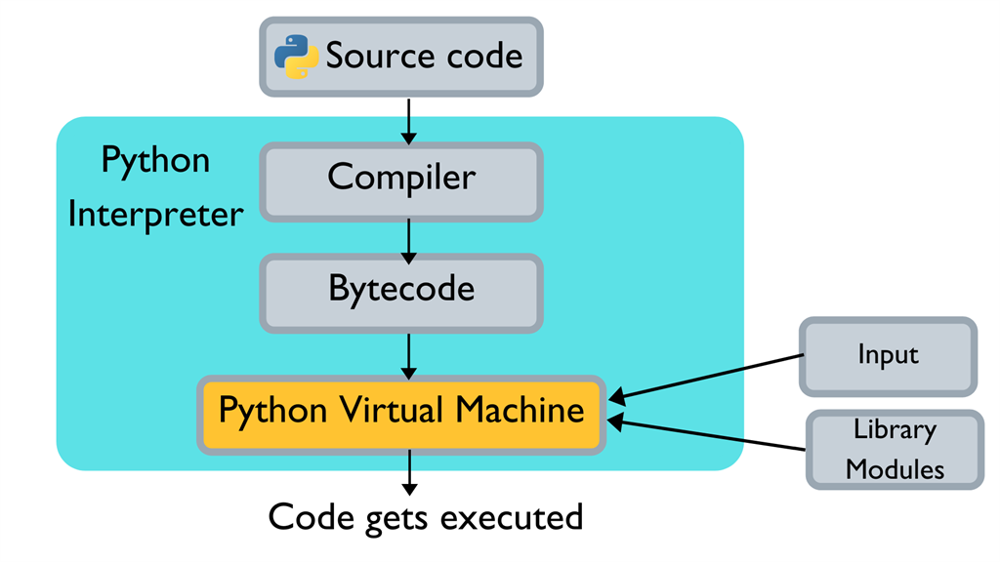

# Python: both compiled and interpreted
Python is considered a **interpreted language**. It does make use of the compilation process. You just don't notice it because it runs automatically.

The compilation step does relatively less work (and the interpreter does relatively more) than in a compiled language.

The Python source code is first compiled into binary **byte code**, instead of directly compiling to the native **machine code** (which is what compiled languages do). 

This interpretation is similar to Java, which is considered both compiled and interpreted langauge.

# Python: interpreter/implentation
An **implementation** of Python is a program or environment which provides support for programs written in the Python language. This is called the **python interpreter**.

When we speak of Python we often mean not just the language but also the **implementation**. The Python language can be implemented in many different ways.

A **Python interpreter** has two main features:
- **compiler**: compiles the Python source code into **byte code**
- **virtual machine**: converts the compiled **byte code** into **machine code**. 

Known Python interpreters:
- **CPython**: compiles to Python Virtual Machine
- **Jypthon**: compiles to the Java Virtual Machine's byte code instead
- **IronPython**: works as an extension to the . NET Framework
- **PyPy**: faster than CPython because PyPy uses a **just-in-time compiler**.

## Compilation
When working with Python, you have to specify the Python interpreter in the IDE program:
- PyCharm
- PyDev
- Jupyter Notebook
- Visual Studio Code

When compiled it converts the *.py* source code file into a compiled *.pyc* output file:

*.py* => *.pyc* (or .pyo if you have the optimizer turned on)

# CPython 
Most often called simply "Python", **CPython** is the default implementation of the Python programming language. CPython is written in C language. 

CPython is said to be slow as the default CPython implementation compiles the python source code in bytecode first, instead of directly to machine code.

# Object and primitive types
CPython is written in C language. Thus this interpeter only has one primitive type, which is **Object** in Python (simply **object** in JavaScript).

However, Python treats this **Object** type as a sort of pre-primitive and derive the actual primitive types from Object. These derived types are called **build-in types**. For all intents and purposes, they can be treated as primitive types.

Numeric types:
- int  (note that bool  actually inherits from int )
- float 
- complex 

Sequence types:
- list
- tuple
- range

Map types:
- dict (this is an implementation of a sorted hashmap)

Binary sequence types:
- bytes
- bytearray
- memoryview

Although **Class** is also considered a **build-in type** it shouldn't be treated as a primitive type.

# Modules
In python a single file behaves almost the same as a module. When there are no global constants in the file it even behaves similar enough that only very rare and weird edge-cases will cause issues.

This module like behaviour is pretty much what more object oriented languages use classes or namespaces for when creating an utility object